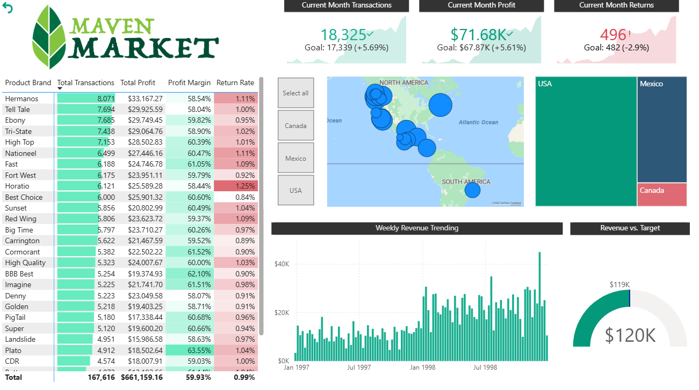

# Retail Sales & Store Performance Dashboard (Power BI)

Power BI dashboard focused on analyzing retail sales, store performance and transaction trends using the Adventure Works dataset.

---

## Overview

This project presents a retail analytics solution designed to provide insights into store performance, product trends and sales distribution across locations.  
It enables users to explore key business metrics and identify top-performing stores and products.

---

## Key Features

- Sales and transaction analysis across stores  
- Profitability and return rate tracking  
- Time-based analysis (YTD, rolling metrics, period comparisons)  
- Store and product performance insights  
- Geographic analysis using map visuals  
- Interactive filtering by country, store and product  

---

## Data Model

- Integrated data from transactions, returns, and store datasets  
- Designed relationships to support multi-dimensional analysis  
- Optimized structure for performance and usability  

---

## Dashboard Preview

### Main Dashboard

---

## Tools & Technologies

- Power BI Desktop  
- DAX  
- Power Query  
- Adventure Works dataset  

---

## Key Learnings

- Building retail-focused BI solutions  
- Designing effective data models  
- Creating business-driven dashboards  
- Applying DAX for analytical insights  

---

## Author

Sara Jovanović  
Belgrade, Serbia  
